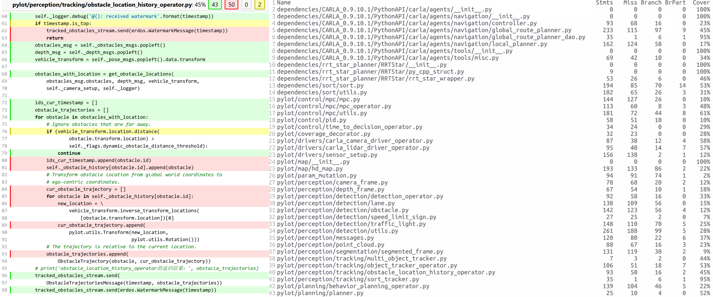

## Neude

This repository provides the code of the paper "**Bridging Code and Models: A Lightweight Coverage-Guided Fuzzing Framework for Hybrid Deep Learning Systems**"

Neude is a lightweight and extensible coverage-guided fuzzing framework designed specifically for hybrid AI-enabled systems. Neude treats the entire system as a unified testing target, leveraging both traditional code coverage and model-specific coverage to guide input generation. We evaluate Neude on Pylot,  a complex autonomous driving system that tightly couples deep learning models with control logic.

## The structure of the repository

```
Neude
├── pylot/                              Pylot autonomous vehicle platform
│   ├── pylot/
│   ├── configs/                        configuration files for different scenarios
│   ├── dependencies/
│   ├── scripts/
│   ├── data/                           collected data (images, logs)
│   ├── covhtml/                        HTML coverage reports
│   ├── error_seeds/                    error-triggering seeds
│   ├── error_infos/                    error information files
│   ├── local_seeds_pool/               local seed pool for fuzzing
├── neude/                         		Neude framework
│   ├── neude/                     		core Neude engine
│   └── traj-dist/                      trajectory distance calculation
├── tmp/                                temporary files and analysis tools
├── mutilprocess/                       multiprocessing test utilities
└── coverage_test/                      coverage testing directory
```

## Installation

We implement all the Neude systems with Tensorflow 2.5.1 and Python 3.8 in the Linux environment. All experiments are conducted on a server with an Intel i7-10700K CPU (3.80 GHz), 48 GB RAM, and an NVIDIA RTX 3070 GPU (8 GB VRAM).

Run the following command to install the dependencies.

```
pip install -r requirements.txt
```

**Coverage**: The coverage library (version 7.6.1) is used for coverage collection and reporting.

#### CALAR Systems

The dataset used for testing is collected using the Pylot data collection script, which gathers data from the Calar system. In addition to the visual data, the runtime information provided by Calar is also recorded, which supports consistent replay and offline analysis. For more details and running options please refer to the [online documentation](http://carla.readthedocs.io).

You can also download and install the version we use：

1. Download dependencies from [link](https://pan.baidu.com/s/1KntMPLX-DlbpGOsZGOMzbg ) to `Neude/pylot`. The extraction code is y9n4.

2. Detailed operation instructions can be found in `dependencies/CARLA_0.9.10.1/README`.

3. Set the `CARLA_HOME` environment variable to facilitate subsequent testing and experimentation.

   ```
   export CARLA_HOME=./pylot/dependencies/CARLA_0.9.10.1/
   ```

#### Pylot

Pylot is an autonomous vehicle platform for developing and testing autonomous vehicle components (e.g., perception, prediction, planning) on the CARLA simulator and real-world cars.

For detailed instructions on Pylot deployment, visualizing components, and manual installation, see pylot/README.md. Version history is recorded in pylot/CHANGELOG.md. You can read the official [documentation](https://pylot.readthedocs.io/en/latest/) for a more in-depth description. 

You can also directly use the Pylot in our project, which uses version 0.3.3. It has been configured to support distributed multi-process coverage collection.

Running Individual Modules：你可以运行单独模块来验证安装是否正确。

- Obstacle Detection Module

```
python3 pylot3.py --flagfile=configs/detection2.conf > detection2.txt 2>&1
```

- Traffic Light Module

```
python3 pylot3.py --flagfile=configs/traffic_light.conf  > traffic_light.txt 2>&1
```

- MPC Control Module

```
python3 pylot3.py --flagfile=configs/mpc2.conf > mpc2.txt 2>&1
```

More module configurations can be found and used in `Neude/pylot/configs/`.

## Usage

Neude combines observations of program execution and neural model coverage to guide input mutations toward unexplored state spaces, enabling systematic evaluation of the entire hybrid pipeline.

Neude is more lightweight in terms of usage. For a function or framework that needs testing, tests can be quickly run by simply adding annotations. During the testing process, the input seed will be automatically mutated based on its type using the methods in `Mutations.py`. Below is an example of using Neude:

1. Set the `PYLOT_HOME` environment variable.

   ```
   cd pylot
   export PYLOT_HOME=`pwd`/
   ```

2. Execute the specified script. This script configures the Python module search path to ensure that Pylot and CARLA modules can be imported correctly.

   ```
   cd $PYLOT_HOME/scripts/
   source ./set_pythonpath.sh
   ```

3. Select the method to be tested, add annotations, and run the test.

   - Below is an example demonstrating the use of @Neude to apply our method.

     ```python
     from neude.main import Neude
     
     @Neude
     def fuzz_interface(imgs:list,y:list,planning_label:list,control_label:list,
                        perfect_depth_estimation:bool,
                        perfect_segmentation:bool, 
                        log_detector_output:bool,
                        log_lane_detection_camera:bool,log_traffic_light_detector_output:bool):
         ...
         target_process.start()
         ...
     
     if __name__ == '__main__':
         fuzz_interface()
     ```

   - Use our configuration to run the test.

     ```
     cd  $PYLOT_HOME/
     python fuzz_list.py dirs seed_list2.txt --has-model True --use-nc True --batch-size 10 | tee terminal_output.txt
     ```

Results and key data are saved in JSON format in the newly created `result/datas` directory.

**Reports**: After the run is completed, you can view the coverage reports for each iteration and the overall coverage in the `covhtml` and `covreport` folders under the run directory. As shown in the figure below:



The report records the line coverage and branch coverage information for each file, as well as a visual representation of the coverage status of each line of code in each code file, including missing_lines, covered_lines, missing_branches, partial_branches, and so on, distinguished by different colors. This allows for a clear and immediate view of the code coverage information and comparisons between different iterations.

## Experiments

Choose the specific method to use and run tests with different configurations. You can use the preset configurations we have provided:

- **Neude_GWCC**（Global Weighted Compositional Coverage）：

  ```
  python fuzz_list_neude_gw.py dirs seed_list2.txt --has-model True --use-nc True --batch-size 10 | tee terminal_output.txt
  ```

- **Neude_PNIC**（Path-Neuron Inclusion Coverage）：

  ```
  python fuzz_list_neude_gw.py dirs seed_list2.txt --has-model True --use-nc True --batch-size 10 | tee terminal_output.txt
  ```

More specific configurations can be set in `neude/config.py`. The path to view the experimental results is described below.

##### RQ1: Fault Detection

**Error seed**: Error seeds for each module are saved separately in `perception_error_seeds`, `planning_error_seeds`, and `control_error_seeds` under the `error_seeds` folder.

**Error informations**: Detailed information for each error is saved in `pylot/error_infos`, numbered by the iteration in which the error occurred.

Output results for perception, planning, and control from each test are saved in the `ious`, `tdist`, and `steer_diff` columns in `datas/100.json`.

##### RQ2: Coverage Improvement

1. **code coverage**: The experiment saves code coverage reports for each iteration, including line coverage and branch coverage information, saved in the path `pylot/covreport`. If you need to view detailed statistics on missing_branches, partial_branches and covered_branches for branch coverage, you can use:

   ```
   python tmp/calculate_branch_coverage.py
   ```

2. **neuron coverage**: Results on how neuron coverage changes with the number of iterations can be found in the `max_nac_rate` column in `datas/100.json`.

##### RQ3: Fault Propagation

1. Quantitative analysis of error propagation. The output results of each module obtained from the test are saved in the `datas/100.json` folder. Based on the output, it can be determined whether any errors have occurred in each module.. To view all the error propagation quantification results, you can use:

   ```
   python tmp/exp_analysis/define_mr_error_all.py
   ```

2. Detailed report on cascading failure cases can be viewed in the `pylot/covhtml` folder. Including the coverage status of each iteration and the overall coverage, providing intuitive code coverage information in HTML format. Users can locate the corresponding HTML file based on the iteration count and the file name requiring code coverage inspection for deeper analysis.

### Baseline

If you wish to use baseline  for testing, please refer to the official documentation and code provided below for configuration.

1. **pythonfuzz**: A state-of-the-art fuzzer designed for deep learning models. Download repo from [link](https://gitlab.com/gitlab-org/security-products/analyzers/fuzzers/pythonfuzz).

2. **deephunter**: A general-purpose coverage-guided fuzzer for Python applications. Download repo from [link](https://github.com/Shimmer93/Deephunter-backup).
3. **Pynguin**: A tool used for automated unit testing. For detailed installation procedures and usage methods, please refer to the [online documentation](https://pynguin.readthedocs.io/) and the [code](https://github.com/se2p/pynguin).

## Custom Configuration

1. Collect data using a custom dataset.

   ```bash
   python3 data_gatherer.py --data_path town5 --simulator_town 2 -log_traffic_lights True --log_obstacles True --log_rgb_camera True --log_trajectories True --log_multiple_object_tracker True  --log_file_name data_gather.log --tracking_num_steps 10 --log_every_nth_message 10
   ```

2. Adjust fuzzing settings in `neude/neude/main.py`.

   - Fuzzing settings:

     ```
     --regression, run the fuzzer through set of files for regression or reproduction
     --rss-limit-mb, Memory usage in MB
     --max-input-size, Max input size in bytes
     --close-fd-mask, Indicate output streams to close at startup
     --runs, Number of individual test runs, -1 (the default) to run indefinitely.
     --timeout, If input takes longer then this timeout the process is treated as failure case
     --cov-vec-save-iter, Iterations to save coverage vector
     --has-model, to justify the system is tested using model
     ```

   - Select save paths in `neude/config.py`, set `config.COV_HTML_PATH`, `config.COV_REPORT_PATH`, `config.CRASH_SEED_PATH`, `config.DATA_SAVE_PATH`, `config.SEED_SAVE_PATH`, `config.ITER_COV_REPORT_PATH`, `config.PROJECT_ERROR_LOG`, `config.ERROR_INFOS_DIR`, `config.LOCAL_SEED_POOL`, etc.

   - Custom mutation strategy: Select a combination of multiple mutation methods from `neude/neude/mutation_ops` and incorporate them into `Mutation.py`.

3. Set the dataset in `pylot/seed_list2.txt`，including the imgs dataset and the labels for perception, planning, and control modules.